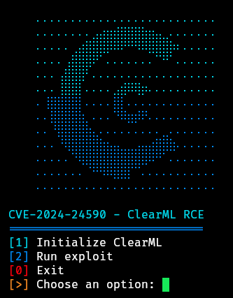

# CVE-2024-24590-ClearML-RCE-Exploit

Python script that exploits the vulnerability CVE-2024-24590 in ClearML, leveraging pickle file deserialization to execute arbitrary code.



## Installation

**Install the required dependencies before proceeding**

Tested on Python 3.9+

### Clone the Repository

```sh
git clone https://github.com/xffsec/CVE-2024-24590-ClearML-RCE-Exploit.git
cd CVE-2024-24590-ClearML-RCE-Exploit
python3 exploit.py
```
